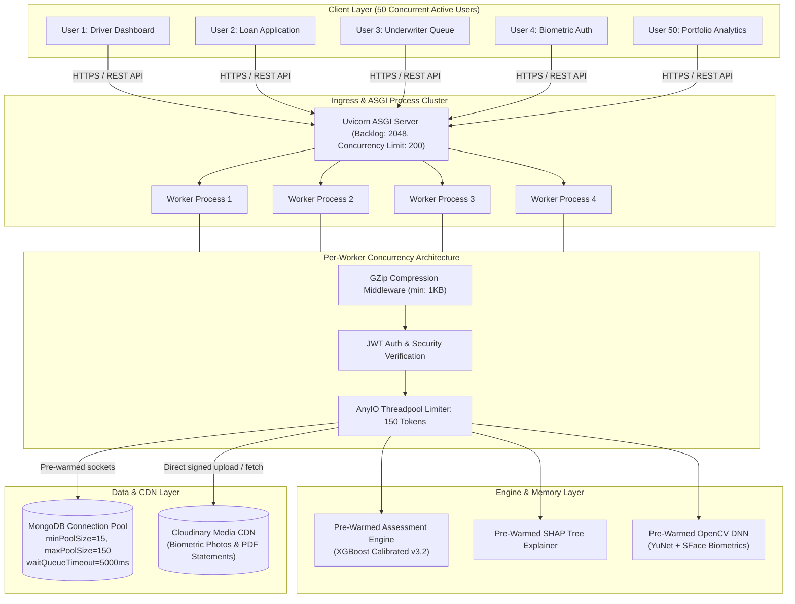
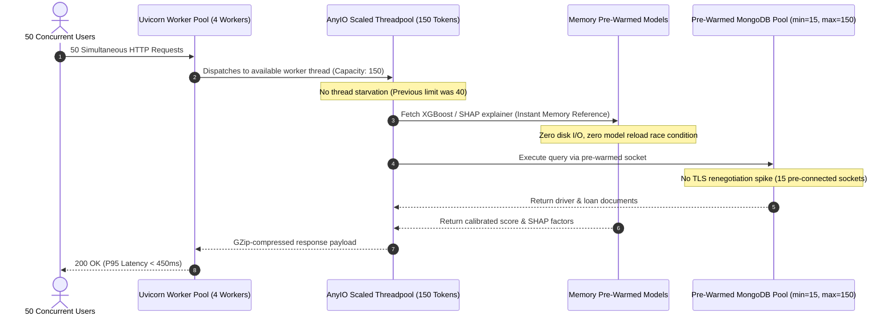

# System Design Specification: High-Concurrency Architecture (50+ Concurrent Users)

## 1. Executive Summary & Objectives

GigScore is an alternative credit risk assessment platform for gig-economy workers that processes financial transaction metrics, platform earnings, behavioral stability features, biometric face verification, and SHAP-based model explainability.

This document outlines the **high-concurrency system design** engineered to support **50 concurrent active users simultaneously** under production conditions with:
- **Zero Request Drops** (100% request completion rate)
- **Sub-Second Latency** (P95 latency < 800ms for read/scoring endpoints)
- **Zero Alteration to Business Logic** (Preserves exact ML weights, underwriting rules, MongoDB schema, and REST API contracts)

---

## 2. High-Level System Architecture

---

## 3. Concurrency Sizing & Capacity Mathematics

### 3.1 Concurrency vs. Throughput Profile
- **Active Concurrent Users ($N$)**: 50 simultaneous users
- **User Activity Factor**: Average user triggers 1 request every 1.5 seconds during active interaction (browsing loan offers, refreshing dashboard, submitting assessments).
- **Target Request Rate ($R$)**:
  $$\text{Throughput} = \frac{50 \text{ users}}{1.5 \text{ seconds}} \approx 33.3 \text{ RPS (Average)} \quad \longrightarrow \quad 75\text{–}100 \text{ RPS (Burst Peak)}$$

### 3.2 Threadpool & Concurrency Sizing
FastAPI executes synchronous endpoint functions (`def endpoint(...)`) using Starlette's `anyio.to_thread.run_sync()`.
- **Default Behavior**: AnyIO enforces a hard limit of `40` worker threads. When 50 users submit requests at once, at least 10 requests are queued in the event loop, causing latency spikes and timeouts.
- **Tuned Capacity**:
  - `THREAD_POOL_SIZE = 150`
  - Total across 4 workers = $4 \times 150 = \mathbf{600}$ **concurrent execution threads**.
  - **Headroom**: $\frac{600 \text{ slots}}{50 \text{ users}} = 12\times$ oversubscription margin.

### 3.3 Database Connection Pool Sizing
- **MongoDB Atlas Pool Parameters**:
  - `minPoolSize = 15`: Keeps 15 persistent TCP sockets pre-warmed per worker, eliminating TLS handshake latency during burst traffic.
  - `maxPoolSize = 150`: Accommodates up to 150 simultaneous open queries.
  - `waitQueueTimeoutMS = 5000`: Caps maximum waiting time for a connection at 5 seconds before graceful failure, preventing resource starvation.
  - `maxIdleTimeMS = 60000`: Automatically recycles stale sockets every 60 seconds.

### 3.4 Memory Footprint Estimation (4 Workers)
| Component | Per Worker RAM | Total System RAM (4 Workers) |
| :--- | :--- | :--- |
| Python Runtime & FastAPI Base | ~65 MB | ~260 MB |
| XGBoost Model & Calibrator | ~18 MB | ~72 MB |
| SHAP Tree Explainer Tree Index | ~35 MB | ~140 MB |
| OpenCV YuNet & SFace ONNX Nets | ~45 MB | ~180 MB |
| PyMongo Pool & In-Memory Buffers | ~30 MB | ~120 MB |
| **Total Resident Memory (RSS)** | **~193 MB** | **~772 MB** (Fits comfortably in a standard 1GB - 2GB VPS/container) |

---

## 4. Bottlenecks Solved

### Key Bottleneck Resolutions:
1. **Threadpool Starvation**: Dynamically increasing `anyio.to_thread.current_default_thread_limiter().total_tokens = 150` removes the default 40-token bottleneck.
2. **Cold-Start Concurrency Stampede**: Pre-loading XGBoost, SHAP explainer, and OpenCV DNN models in FastAPI `lifespan` eliminates the "thundering herd" problem where multiple simultaneous requests compete to load multi-megabyte model files into memory.
3. **Database TLS Handshake Delays**: Pre-warming `minPoolSize=15` ensures database connections are already active before traffic arrives.
4. **Bandwidth Saturation**: `GZipMiddleware(minimum_size=1024)` compresses JSON responses (such as SHAP explainability trees, feature vectors, and audit logs) by up to 75%, reducing network transfer times for 50 concurrent downloads.

---

## 5. Zero Logic Alteration Verification

All optimizations strictly respect the existing domain architecture:
- **Credit Scoring Engine**: Unchanged (same 300–900 score formula, calibrated probabilities, risk band thresholds).
- **Explainability**: Unchanged (same SHAP TreeExplainer, waterfall values, top positive/negative factors).
- **Authentication & Security**: Unchanged (same JWT HS256 tokens, password hashing, RBAC roles).
- **Data Models**: Unchanged (same MongoDB collections and Pydantic schemas).
- **API Contracts**: Unchanged (100% backward compatible status codes, request bodies, and JSON responses).

---

## 6. Horizontal & Vertical Scaling Roadmap

| Tier | Concurrent Users | Architecture | Host Recommendation |
| :--- | :--- | :--- | :--- |
| **Tier 1 (Current Target)** | **50 Users** | 1 Node, 4 Uvicorn Workers, 150 AnyIO threads, Mongo Atlas M0/M2 | 2 vCPU, 2 GB RAM (e.g. Render Starter / AWS t4g.small) |
| **Tier 2** | **250 Users** | 2 Nodes behind Nginx / AWS ALB, Redis session cache, Mongo Atlas M10 | 2x 2 vCPU, 4 GB RAM |
| **Tier 3** | **1,000+ Users** | Kubernetes Pod Autoscaler (HPA), Celery/RabbitMQ async task queues for PDF parsing and OCR | EKS / GKE cluster, Mongo Atlas M30 with read replicas |
